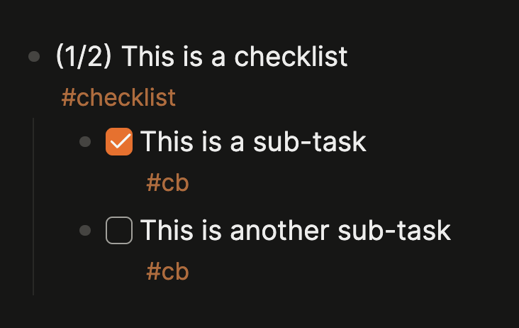

# Logseq Checklist Progress Indicator

Automatically adds progress indicators to blocks tagged with `#checklist`, showing completion status like `(2/5)` based on child checkbox items.

> **⚠️ Important:** This plugin requires **Logseq 0.11.0+** with **DB graphs only**. It does not work with markdown/file-based graphs.

## Features

- ✅ **Automatic real-time updates** - Progress updates instantly as you toggle checkboxes
- ✅ **Recursive counting** - Counts checkboxes at any depth in the tree
- ✅ **Debounced updates** - Intelligent batching prevents UI thrashing
- ✅ **Zero configuration** - Works out of the box with sensible defaults
- ✅ **DB graph support** - Designed for Logseq's modern database graphs

## Screenshots



*The plugin automatically adds `(1/2)` progress indicators to blocks tagged with `#checklist`. Note: The screenshot shows custom tags (`#cb`), but the default checkbox tag is `#checkbox`. Both tags are configurable in plugin settings.*

## Installation

> **Note:** This plugin is pending approval for the Logseq marketplace. Once approved, it will be available via Settings → Plugins → Marketplace.

**Current installation method:**

1. Download the latest release from the [Releases page](https://github.com/kerim/logseq-checklist/releases)
2. Unzip the downloaded file
3. In Logseq, go to Settings → Plugins → Load unpacked plugin
4. Select the unzipped plugin directory

## Usage

### Basic Setup

1. Create a block and tag it with `#checklist`
2. Add child blocks tagged with `#checkbox`
3. If the `#checkbox` class doesn't exist yet, Logseq will prompt you to create it as a class
4. Add a checkbox property to the `#checkbox` class (if not already configured)
5. Progress indicators appear automatically and update as you toggle checkboxes

**Example:**

```
- (1/3) Watch these films #checklist
  - The Matrix #checkbox
  - Inception #checkbox
  - Interstellar #checkbox
```

The `(1/3)` indicator updates automatically when you toggle the checkbox property on child blocks.

### Nested Checklists

You can create nested checklists by tagging any child block with `#checklist`:

```
- (2/5) Project tasks #checklist
  - (1/2) Design phase #checklist #checkbox
    - Create mockups #checkbox
    - Get feedback #checkbox
  - (0/2) Development phase #checklist #checkbox
    - Write code #checkbox
    - Write tests #checkbox
  - Deploy #checkbox
```

Each checklist maintains its own progress indicator.

## How It Works

### Checkbox Detection
- The plugin counts only blocks tagged with `#checkbox` that are nested under blocks tagged with `#checklist`
- The `#checkbox` class should have a checkbox-type property defined
- Checkbox state: `true` = checked ✅, `false` = unchecked ☐

### Progress Calculation
- Recursively traverses all child blocks (any depth) under `#checklist` blocks
- Counts total blocks tagged with `#checkbox`
- Counts how many have `true` checkbox property values
- Displays as `(checked/total)` at the start of the checklist block

### Update Mechanism
- Uses Logseq's `DB.onChanged` listener to detect checkbox changes
- Updates are debounced over 300ms to batch rapid changes
- Only modifies blocks when progress actually changes

## Configuration

The plugin includes configurable settings (Settings → Plugins → Checklist Progress Indicator):

- **Checklist Tag**: Tag used to identify checklist blocks (default: `checklist`)
- **Checkbox Tag**: Tag used to identify checkbox blocks (default: `checkbox`)

## Requirements

- **Logseq:** 0.11.0 or newer (DB graph support required)
- **Graph type:** Database graphs only (not markdown/file-based graphs)

## Troubleshooting

### Progress indicator not appearing?

1. Verify parent block is tagged with `#checklist`
2. Ensure child blocks are tagged with `#checkbox` (not markdown checkboxes like `- [ ]`)
3. Check that the `#checkbox` class exists and has a checkbox property configured
4. Reload Logseq and try again

### Wrong count?

1. Check that all checkbox blocks are properly tagged with `#checkbox`
2. Verify nested checklists each have their own `#checklist` tag if needed
3. Reload the page to force a recalculation

### Automatic updates not working?

1. Confirm you're using Logseq 0.11.0 or newer
2. Check browser console (Cmd/Ctrl+Shift+I) for error messages
3. Verify you're using a DB graph (not a markdown graph)
4. Try reloading the plugin (Settings → Plugins → reload)

## Development

### Build Commands

- `pnpm run build` - Production build
- `pnpm run dev` - Development build with watch mode

### Project Structure

```
logseq-checklist/
├── src/
│   ├── index.ts      # Plugin initialization
│   ├── progress.ts   # Checkbox counting and progress updates
│   ├── events.ts     # DB.onChanged handler, parent finding
│   ├── content.ts    # Text manipulation utilities
│   ├── settings.ts   # Plugin settings
│   └── types.ts      # TypeScript interfaces
├── dist/             # Build output (auto-generated)
├── CHANGELOG.md      # Version history
└── package.json      # Dependencies & metadata
```

## License

MIT

## Contributing

Contributions welcome! Please:
1. Test thoroughly with DB graphs
2. Follow the existing code style
3. Update CHANGELOG.md with your changes
4. Submit a pull request

## Credits

Created by [P. Kerim Friedman](https://github.com/kerim)

Built with:
- [Logseq Plugin API](https://github.com/logseq/logseq)
- [@logseq/libs](https://www.npmjs.com/package/@logseq/libs)
- [Vite](https://vitejs.dev/)
- [vite-plugin-logseq](https://www.npmjs.com/package/vite-plugin-logseq)
